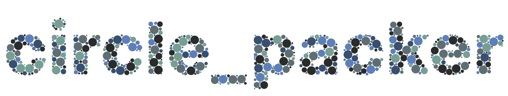

This project programmatically packs strings of text with circles. The result is a complex, visually pleasing image made up of simple elements.

With configuration changes, the project supports drawing both PNG and SVG files. Theoretically, the SVG output could be used as input to a pen plotter.

# Process
1. Render text to a mask buffer - keep track of the bounding box of the text.
2. Generate a list of random circle radii, sorted from largest to smallest.
3. Iterate through the list of radii and pick a random point within the text bounding box to try and place a circle of the chosen radius
4. Determine if the new circle is inside the mask. This is done by checking 8 points around the circumference of the circle as well as the center. If the circle does not fit inside the mask, pick a new point and retry. There is a limit on how many retries will occur.
5. Check if the new circle would overlap any already placed circles. If the circle would overlap another, pick a new point and retry. There is a limit on how many retries will occur.
6. Save the new circle to a list.
7. After all radii have been attempted, loop through the list of placed circles and render them.
